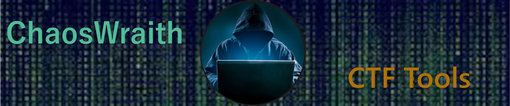

<table>
  <tr>
    <td>
      <a href="Scripts/InstallCTFTools.ps1" target="_blank">Download CTFTools Installer Script</a>
    </td>
  </tr>
  </table>

<table>
  <h2><a href="https://github.com/HankBoone/CTFTools/tree/main/Installers">Installers</a></h2>
  <tr>
    <td>
      
    </td>
    <td>
      <h4>Burp Suite</h4>
    </td>
    <td>
      

        Burp Suite is an integrated platform/graphical tool for performing__
        security testing of web applications. Its various tools work seamlessly__
        together to support the entire testing process, from initial mapping__
        and analysis of an application's attack surface, through to finding and__
        exploiting security vulnerabilities.
      

    </td>
    </tr>
  <tr>
    <td>
      
    </td>
    <td>
      <h4>Metasploit</h4>
    </td>
  <td>
    

    What is Metasploit used for? The Metasploit framework is a very powerful__
    tool which can be used by cybercriminals as well as ethical hackers to probe__
    systematic vulnerabilities on networks and servers. Because it's an open-source__
    framework, it can be easily customized and used with most operating systems.
    

  </td>
    </tr>
  <tr>
    <td>
      
    </td>
    <td>
      <h4>Wireshark</h4>
    </td>
  <td>
    

      Wireshark is a free and open-source packet analyzer. It is used for network__
      troubleshooting, analysis, software and communications protocol development,__
      and education.
    

  </td>
    </tr>
  <tr>
    <td>
      
    </td>
    <td>
      <h4>NMAP</h4>
    </td>
  <td>
    

      Nmap is a network scanner created by Gordon Lyon. Nmap is used to discover__
      hosts and services on a computer network by sending packets and analyzing__
      the responses.
    

  </td>
    </tr>
</table>
<table>
  <h2><a href="https://github.com/HankBoone/CTFTools/tree/main/VMs">Virtual Machines</a></h2>
  <tr>
    <td>
      
    </td>
    <td>
      <h4>Kali Linux</h4>
    </td>
  </tr>
  <tr>
    <td>
      
    </td>
    <td>
      <h4>Parrot OS</h4>
    </td>
  </tr>
  <tr>
    <td>
    
    </td>
    <td>
      <h4>Ubuntu</h4>
    </td>
  </tr>
  </table>
